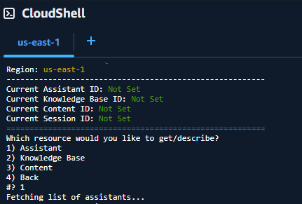
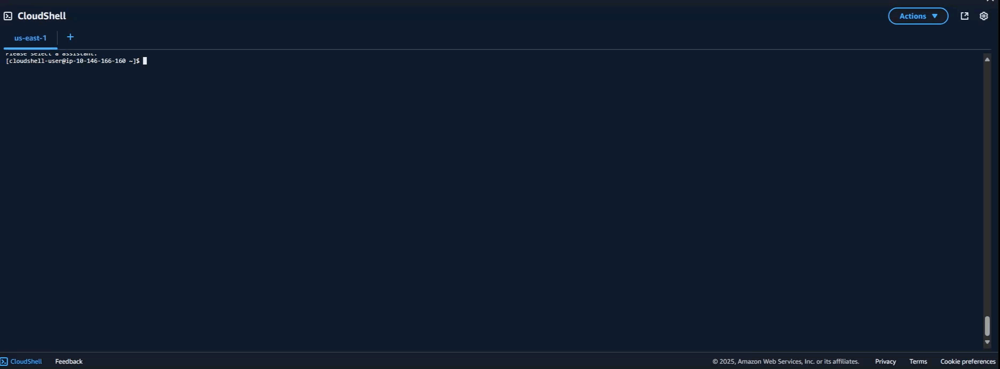

# Q-Menu: AWS Q in Connect Menu Script





## Overview

`q-menu.sh` is a menu-driven Bash script that provides a user-friendly interface for managing AWS Q in Connect resources. It allows you to list, create, describe, and delete Assistants, Knowledge Bases, and Content in your AWS environment using the AWS CLI.

---

## Features
- **Interactive Menus:** Easily navigate AWS Q in Connect resources with simple menus.
- **Resource Management:** List, create, describe, and delete Assistants and Knowledge Bases.
- **Content Operations:** View and select content within a Knowledge Base.
- **Quick Responses:** Search for quick responses in a Knowledge Base.
- **Settings:** Change AWS region and clear stored resource IDs.
- **Dependency Checks:** Ensures required tools (`aws`, `jq`) are installed before running.

---

## Prerequisites
- **AWS CLI:** [Install instructions](https://docs.aws.amazon.com/cli/latest/userguide/getting-started-install.html)
- **jq:** [Install instructions](https://stedolan.github.io/jq/download/)
- **Bash Shell:** Script is designed for Unix-like environments (Linux, macOS, WSL on Windows).
- **AWS Credentials:** Ensure your AWS CLI is configured with appropriate credentials and permissions for AWS Q in Connect.

---

## Usage

1. **Clone or Download** this repository.
2. **Make the script executable:**
   ```bash
   chmod +x q-menu.sh
   ```
3. **Run the script:**
   ```bash
   ./q-menu.sh
   ```
4. **Follow the on-screen menus** to manage your AWS Q in Connect resources.

---

## Menu Structure
- **List Resources:** View existing Assistants, Knowledge Bases, Content, and Quick Responses.
- **Create Resource:** Create new Assistants or Knowledge Bases.
- **Get/Describe Resource:** View details for a specific Assistant, Knowledge Base, or Content.
- **Delete Resource:** Permanently delete Assistants or Knowledge Bases.
- **Settings:** Change AWS region or clear stored IDs.

---

## Notes
- **Destructive Actions:** Deletions are permanent. The script will prompt for confirmation before deleting resources.
- **Region:** Default AWS region is `us-east-1`, but can be changed in the Settings menu.
- **State:** The script stores selected resource IDs in memory for the session only.

---

## Troubleshooting
- If you see errors about missing commands, ensure both `aws` and `jq` are installed and available in your PATH.
- Make sure your AWS credentials are set up and have the necessary permissions for AWS Q in Connect operations.

---

## License
This script is provided as-is, without warranty. Use at your own risk. 